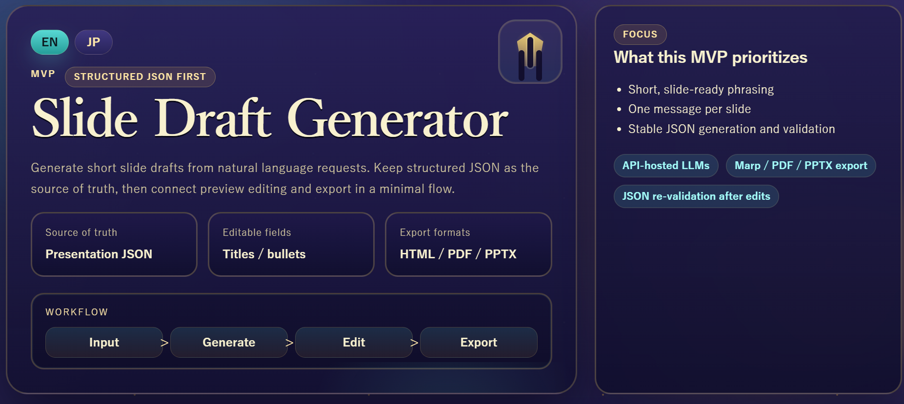
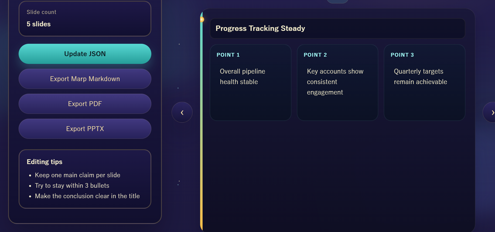

# slide_app

`slide_app` is a FastAPI-based slide drafting system that turns a short natural-language request into structured slide JSON, an editable HTML preview, and optional Marp/PDF/PPTX exports.

The project focuses on a practical applied-LLM problem: generating first-draft presentation content in a format that is constrained, inspectable, and easy to post-process instead of relying on opaque free-form text generation.

## Quick Summary

- Input: a short presentation request in Japanese or English
- Core output: validated slide JSON, not raw prose
- Review flow: editable HTML preview before any export
- Export flow: Marp, PDF, and PPTX only when explicitly triggered
- Demo path: can run locally with `MOCK_GENERATION=true`

## Why This Repo Is Worth Reviewing

- it shows a provider-swappable LLM pipeline instead of coupling the app to one model vendor
- it uses schema validation and repair before rendering anything user-facing
- it keeps JSON as the system contract, which makes preview and export layers easier to maintain

## Reviewer Quick Start

If you want the fastest way to understand the project:

1. Read the architecture section below
2. Open [`samples/sample_input.json`](/home/sora/dev/llm-apps/slide_app/samples/sample_input.json) and [`samples/sample_output.json`](/home/sora/dev/llm-apps/slide_app/samples/sample_output.json)
3. Run the app in mock mode
4. Generate a deck and inspect the preview screen

## What It Does

- accepts a presentation request such as topic, audience, objective, and required talking points
- generates a validated slide deck in a constrained JSON schema
- renders an HTML preview for review and lightweight edits
- exports the same deck to Marp markdown, PDF, and PPTX
- supports multiple inference backends through a provider abstraction
- supports mock generation for reproducible local demos without external API calls
- supports a `JP / EN` UI toggle for portfolio-friendly demos

## Why It Matters

Many LLM demos stop at "text in, text out." This project shows a more production-oriented pattern:

- structured output is the system contract
- validation and repair happen before rendering
- downstream rendering and export are provider-agnostic
- the same pipeline can run against hosted APIs or local model servers

This makes the system easier to test, safer to extend, and easier to adapt to different model providers.

## Architecture

```text
User Request
-> Preprocess
-> Prompt Builder
-> LLM Provider
-> Response Parse / Validate / Repair
-> Presentation JSON
-> Layout Resolver
-> HTML Preview / Marp / PDF / PPTX
```

Core application areas:

- `app/routes/`: FastAPI endpoints for generation, rendering, and export
- `app/services/`: generation, provider, rendering, Marp, and PPTX services
- `app/models/`: Pydantic schemas for the slide contract
- `samples/`: example requests and outputs for quick inspection
- `tests/`: unit and service-level tests

## Tech Stack

- Python 3
- FastAPI
- Pydantic v2
- httpx
- Jinja2
- python-pptx
- pytest

## Output Contract

The canonical output is structured presentation JSON:

```json
{
  "deck_title": "string",
  "slides": [
    {
      "id": "string",
      "type": "title | agenda | content | summary",
      "title": "string",
      "bullets": ["string"],
      "layout": "layout1 | layout2 | layout3 | layout4"
    }
  ]
}
```

Current generation rules include:

- 3 to 10 slides
- 1 to 4 bullets per slide
- first slide must be `title`
- last slide must be `summary`
- at least one `content` slide is required
- output language follows the request language for Japanese and English prompts

Example input: [`samples/sample_input.json`](/home/sora/dev/llm-apps/slide_app/samples/sample_input.json)  
Example output: [`samples/sample_output.json`](/home/sora/dev/llm-apps/slide_app/samples/sample_output.json)

## Visual Demo

Screenshot notes live in [`docs/screenshots/README.md`](/home/sora/dev/llm-apps/slide_app/docs/screenshots/README.md).
Recommended file paths:

- `docs/screenshots/input_en.png`
- `docs/screenshots/preview_en.png`

If those files are present, GitHub will render the screenshots below.

### English Input UI



### English Preview UI



## How To Run

### Fastest Local Demo

```bash
python3 -m venv .venv
source .venv/bin/activate
pip install -r requirements.txt
cp .env.example .env
export MOCK_GENERATION=true
uvicorn app.main:app --reload
```

Then open `http://127.0.0.1:8000/`.

### Full Setup

```bash
python3 -m venv .venv
source .venv/bin/activate
pip install -r requirements.txt
cp .env.example .env
```

### Provider Setup

For the fastest reproducible demo, use mock mode:

```bash
export MOCK_GENERATION=true
```

For Gemini:

```bash
export LLM_PROVIDER=gemini
export GEMINI_API_KEY=your_gemini_api_key
export GEMINI_MODEL=gemini-2.5-flash
```

For an OpenAI-compatible endpoint:

```bash
export LLM_PROVIDER=api
export LLM_API_KEY=your_api_key
export LLM_MODEL=gpt-4.1-mini
export LLM_BASE_URL=https://api.openai.com/v1
```

For local model servers:

- `LLM_PROVIDER=ollama`
- `LLM_PROVIDER=lmstudio`

### 3. Start the app

```bash
uvicorn app.main:app --reload
```

Or use the helper script:

```bash
bash scripts/start_server.sh
```

The helper script defaults to `LLM_PROVIDER=api` and only tries to bootstrap Ollama when `LLM_PROVIDER=ollama`.

### 4. Open the UI

- `http://127.0.0.1:8000/`
- `http://127.0.0.1:8000/preview`

## Example Local Flow

1. Start the app in mock mode
2. Paste a short request such as `Create a 5-slide update for a sales director covering current progress, key issues, and next actions.`
3. Click generate
4. Review the HTML preview and the generated JSON
5. Export only if you want Marp, PDF, or PPTX output

## API Surface

- `POST /api/generate`: create validated slide JSON from a request
- `POST /api/render/html`: render HTML preview from presentation JSON
- `POST /api/update`: re-validate edited presentation JSON
- `POST /api/export/marp`: export Marp markdown
- `POST /api/export/pdf`: export PDF
- `POST /api/export/pptx`: export PPTX
- `GET /api/debug/provider-health`: provider health check
- `GET /api/export/debug/config`: export tool configuration check

Example request:

```bash
curl -X POST http://127.0.0.1:8000/api/generate \
  -H "Content-Type: application/json" \
  -d @samples/sample_input.json
```

Fixture runner:

```bash
python scripts/run_generation_fixture.py \
  samples/sample_input.json \
  --output-json /tmp/slide_output.json
```

Common verification commands:

```bash
curl http://127.0.0.1:8000/api/debug/provider-health
./.venv/bin/pytest
```

## Environment Variables

Copy [`.env.example`](/home/sora/dev/llm-apps/slide_app/.env.example) and set only the variables needed for your chosen provider.

Important variables:

- `LLM_PROVIDER`: `gemini`, `api`, `openai_compatible`, `ollama`, or `lmstudio`
- `MOCK_GENERATION`: disables external model calls for local demo use
- `LLM_API_KEY`, `LLM_MODEL`, `LLM_BASE_URL`: generic API-compatible provider settings
- `GEMINI_API_KEY`, `GEMINI_MODEL`, `GEMINI_BASE_URL`: Gemini settings
- `OLLAMA_BASE_URL`, `OLLAMA_MODEL`: local Ollama settings
- `LMSTUDIO_BASE_URL`, `LMSTUDIO_MODEL`: local LM Studio settings
- `MARP_CLI_PATH`, `CHROME_PATH`: required for PDF export depending on local setup

## Testing

```bash
./.venv/bin/pytest
```

Current test coverage includes schema validation, provider wrappers, rendering, export services, and API-level behavior.

## Common Setup Notes

- if you only want a portfolio demo, set `MOCK_GENERATION=true` and skip API keys
- if PDF export fails, check `MARP_CLI_PATH` and `CHROME_PATH`
- if generation fails with a hosted provider, verify `LLM_PROVIDER`, `LLM_API_KEY`, and `LLM_BASE_URL`

## Limitations

- the current prompt and validation flow is optimized for Japanese internal presentation drafts
- visual output quality depends on the selected layout templates and export tooling
- PDF export depends on local Marp/Chrome availability
- the system produces draft-quality slides, not final polished design assets
- there is no persistent storage, auth layer, or asynchronous job queue yet

## Next Steps

- add real screenshots or a short GIF showing input to preview to export flow
- add request/response fixtures for English prompts and more deck types
- add lightweight observability around generation latency and provider failures
- package a one-command local demo path for portfolio reviewers

## Suggested GitHub Metadata

Repository description:

`FastAPI app that generates Japanese internal slide drafts from natural language using API-hosted LLMs and structured JSON.`

Suggested topics:

- `fastapi`
- `python`
- `llm`
- `applied-ai`
- `structured-output`
- `pydantic`
- `prompt-engineering`
- `pptx`

## Notes

- this repository is intended as a portfolio-ready MVP, not a production deployment
- local `.env` values and API keys are not included in the repository
